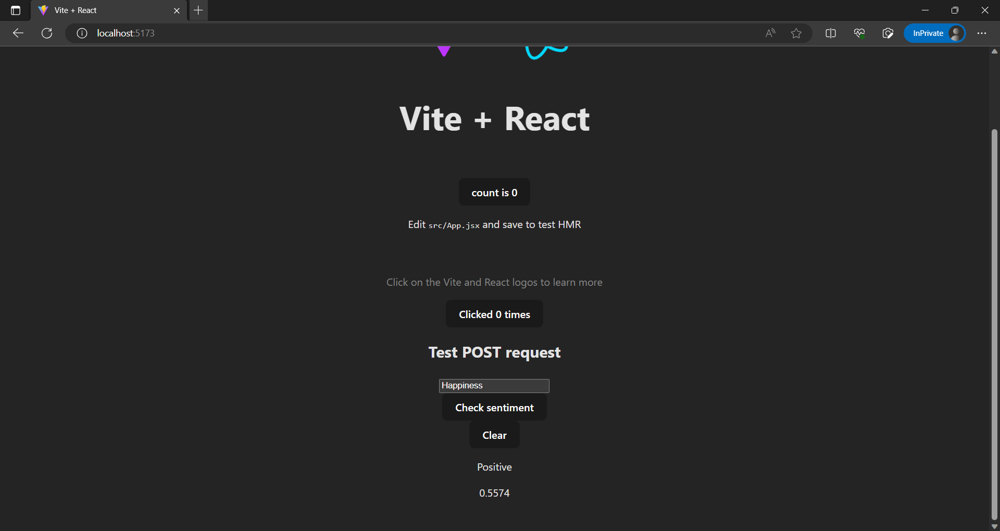
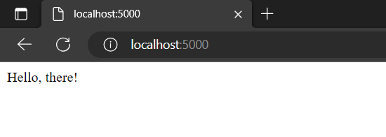
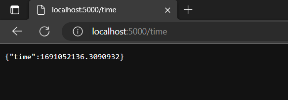

# ViteReactFlask

A small web app build with React as front-end and Flask as back-end. Created frontend React app with Vite.


## Installation
1. First clone this repository

2. \[Front-end\] Install the dependencies for the React app
```bash
cd vite-frontend
npm install
```

3. \[Back-end\] Install the dependencies for the Flask app

Navigate to the back-end folder, create a virtual environment, activate it, and install the dependencies.

```bash
cd flask-backend
python -m venv .venv
.venv\Scripts\activate
pip install -r requirements.txt
```

4. Run the app

Refer to [How to run the app](#how-to-run-the-app) for details.

## My development process

I used VSCode on Windows 11 to develop this app.

1. \[Front-end\] Create a new React app with Vite

Reference: https://vitejs.dev/guide/

First I went to the directory where I wanted to create the app, then I ran the following command:
```bash
npx create-vite@latest
```

I then entered the folder name `vite-frontend`, selected React as the framework and JavaScript as the variant.

After that, I installed the npm dependencies:
```bash
cd vite-frontend
npm install
```

2. \[Back-end\] Create a Flask app

Create a new folder called `flask-backend` and create a new file called `app.py` inside it.

```bash
mkdir flask-backend
cd flask-backend
code app.py
```

Then I wrote some code inside `app.py` to create a Flask app. See `app.py` for details.

I also added requirements.txt so that when I enabled the virtual environment, I could install the dependencies with the following command:
```bash
pip install -r requirements.txt
```

3. \[Back-end\] Create a virtual environment for Flask backend

Create a virtual environment called `.venv` inside the `flask-backend` folder.
```bash
python -m venv .venv
```

Then I enabled the virtual environment and installed the dependencies.
```bash
.venv\Scripts\activate
pip install -r requirements.txt
```

4. \[Front-end\] Create a proxy for the React app

In the `vite.config.js` file in the `vite-frontend` folder, I added the following code to it:
```js
export default defineConfig({
  plugins: [react()],
  server: {
    proxy: {
      '/api': {
        target: 'http://127.0.0.1:5000',
        changeOrigin: true,
        rewrite: (path) => path.replace(/^\/api/, ''),
      },
    },
  },
})
```

(Note: the target must be set to 'http://127.0.0.1:5000' instead of 'http://localhost:5000' in order for the proxy server to work. I'm not sure why.)

Reference: https://vitejs.dev/config/

5. \[Front-end\] Create a React component to fetch data from the Flask backend
Refer to `src/App.jsx`, `` for details.

6. Run the web app

Refer to [How to run the app](#how-to-run-the-app) for details.

## How to run the app

### Front-end: React application

Navigate to the front-end folder 
```bash
cd vite-frontend
```

Run the following command to start the app
```
npm run dev
```

### Back-end: Flask application


Navigate to the back-end folder:
```bash
cd flask-backend
```


If not already, enable the virtual environment:
```bash
.venv\Scripts\activate
```

Run the following command to start the app:
```bash
flask --app app.py run
```
or

```bash
flask run
```
(this command will automatically run the Flask application since we named the main python file as `app.py`)

or

```bash
python app.py
```

## Demo

The web app should be running at http://localhost:5173/, unless specified otherwise by Vite.

Enter a sentence in the text box and click the button to see the sentiment result.



If you want to see how the backend works, go to http://localhost:5000/ to see the backend index page.



and http://localhost:5000/time to see the current time returned in JSON.



## References, resources, and further notices

### References and resources

- [How To Create a React + Flask Project](https://blog.miguelgrinberg.com/post/how-to-create-a-react--flask-project) by Miguel Grinberg
- [React](https://react.dev/)
- [Vite](https://vitejs.dev/guide/)
- [Flask](https://flask.palletsprojects.com/en/)

### Further notices:
- This app is only in development mode, not in production mode yet. To deploy the app to production, refer to [How to Deploy a React + Flask Project](https://blog.miguelgrinberg.com/post/how-to-deploy-a-react--flask-project) by Miguel Grinberg to learn how to do it.
- When I developed the app using `create-react-app`, sometimes I cannot setup the proxy server to work. The fetch() function kept routing to localhost:3000 instead of localhost:5000. 
- There is another way to integrate Vite with Flask, see:
    - https://vitejs.dev/guide/backend-integration.html
    - https://github.com/vitejs/awesome-vite#integrations-with-backends
    - https://github.com/abilian/flask-vite

- however, I have not tried it yet. 

